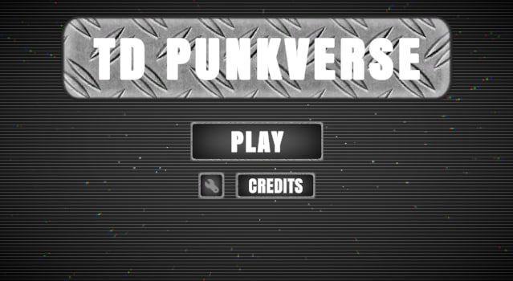
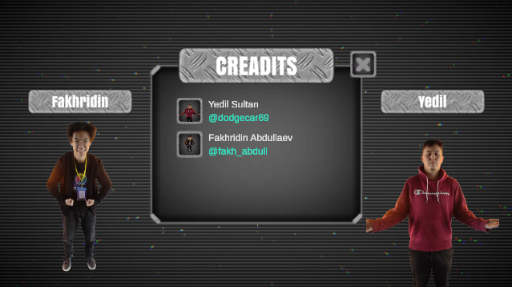
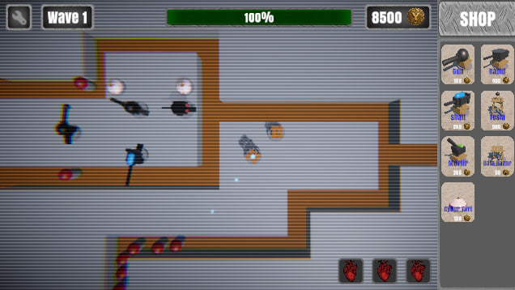
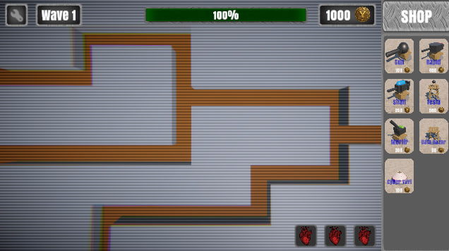
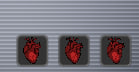

# TD Punkverse - Project Report

## 1️⃣ Team Name
**Team:** YStudio

## 2️⃣ Project Name
**Project:** TD Punkverse

## 3️⃣ Short Project Description
TD Punkverse is a tower defense game with a futuristic cyberpunk theme. Players strategically place different types of towers to defend against waves of enemies. Each tower has unique abilities, attack ranges, and buffs, making strategic placement and timing crucial. The game also features interactive environments and resource management to enhance gameplay depth.

## 4️⃣ Project Screenshots

## 5️⃣ Secret Words
**Secret Words Used in the Game:**

1. **Data Bazar** – Gives YCoins passively each X seconds. 
   - **Where:** Tower placement interface and path markers.  
   - **Screenshot:** 

2. **Cyber Yurt** – Buffs near Towers' workSpeed.
   - **Where:** Shooting tower ability description and UI icon.  
   - **Screenshot:** 

3. **Heart** – Player health which has nice pop up animation when taking damage.
   - **Where:** Visual design of towers and ground grid patterns.  
   - **Screenshot:** 

> All secret words are fully implemented in gameplay or visuals to meet theme requirements.

---

### 📝 Notes
- This report includes **team info, project name, description, screenshots, and secret word explanations**.  
- All screenshots can be found in the `Screenshots/` folder of the project repository's Asset.  
- This document serves as the **mandatory project report** for submission.

## Links

https://yedilstudio.itch.io/td-punkverse

https://www.canva.com/design/DAG6JR23weA/167rx3KkyUZe1nYZs6SrMQ/edit?utm_content=DAG6JR23weA&utm_campaign=designshare&utm_medium=link2&utm_source=sharebutton

https://github.com/Yedil-sama/TD-Punkverse

https://drive.google.com/drive/folders/1Yem8vn4bNzXJICliuxMP9q3ad7cvs_T-